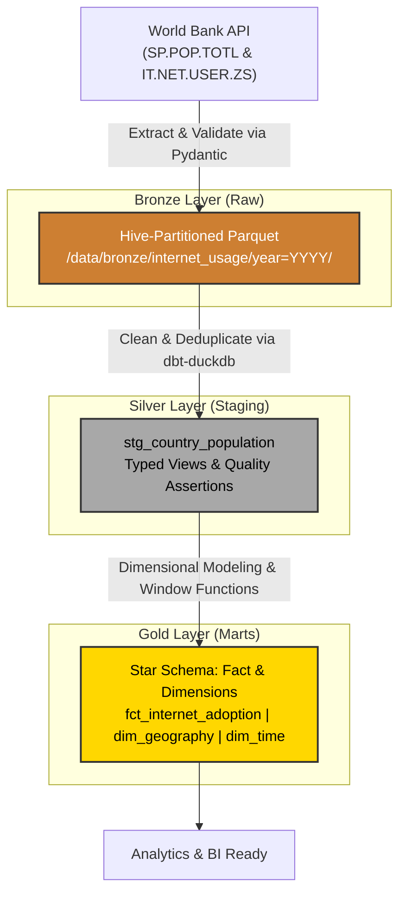

# VizPy: Global Internet Adoption ELT Pipeline

An end-to-end Data Engineering ELT pipeline tracking global internet adoption and population growth, orchestrated with **Prefect**, transformed via **dbt** and **DuckDB**, and containerized for reproducibility.

## The Origin Story: From Script to System

This project originally began as a simple data visualization assignment for the **SheCodes Python Advanced Course**. The original codebase consisted of procedural Python scripts that read a static, hardcoded `data.csv` file into nested in-memory dictionaries and generated Matplotlib charts. 

While it succeeded as a visualization exercise, I recently revisited the repository to completely re-architect it into a **fully fledged Data Engineering portfolio piece**. The focus shifted from *how the data is displayed* to *how the data system is built, scaled, and secured*. 

**The upgrades included:**
* Replacing static CSV reads with dynamic, paginated API extraction from the **World Bank API**.
* Replacing in-memory nested dictionaries with a **Medallion Architecture (Bronze, Silver, Gold)**.
* Implementing strict data contracts using **Pydantic** to quarantine bad data before it hits the data lake.
* Transitioning storage to columnar **Apache Parquet** using **PyArrow**.
* Moving transformations from Python loops to scalable SQL models using **dbt** and **DuckDB**.
* Orchestrating the workflow with **Prefect** and standardizing the environment with **Docker** and **uv**.

---

## Architecture & Tech Stack

This pipeline utilizes modern, lightweight data tooling to achieve analytical performance without the overhead of heavy cloud infrastructure.

* **Environment Manager:** `uv` (Lightning-fast Rust-based package manager)
* **Ingestion (Extract & Load):** Python, `requests`, `pyarrow`
* **Data Contracts:** `pydantic` (Schema validation & Dead-letter queuing)
* **Storage (Bronze):** Local Data Lake (Hive-partitioned Apache Parquet)
* **Transformation (Silver & Gold):** `dbt` (Data Build Tool), DuckDB
* **Orchestration:** Prefect
* **Infrastructure:** Docker & Docker Compose
* **CI/CD:** GitHub Actions (Linting with Ruff, Unit testing with Pytest, E2E workflow testing)

### The Medallion Data Flow



---

## Data Quality Guarantees

This pipeline implements a defense-in-depth approach:

1. **Pre-Ingest Contracts (Pydantic):** Rejects anomalous API payloads (e.g., negative populations, out-of-bounds percentages, invalid ISO formats) before they hit the data lake, routing them to a Quarantine log instead of crashing the pipeline.
2. **Structural Assertions (dbt):** Schema tests enforce Primary Key / Foreign Key uniqueness and referential integrity between fact and dimension tables.
3. **Business Logic Tests (dbt):** Singular SQL tests guarantee logical consistency (e.g., ensuring total internet users never exceed the total population count of a given country).

---

## Quick Start

You can run this pipeline in a completely isolated Docker container, or locally using `uv`.

### Option A: Run via Docker (Recommended)

You do not need Python installed on your host machine to run this.

```bash
# 1. Fork the repository

# 2. Clone the repository

git clone [https://github.com/yourusername/vizpy-program.git](https://github.com/yourusername/vizpy-program.git)
cd vizpy-program

# 3. Build the image and run the end-to-end pipeline
docker compose up --build

```

*(This triggers Prefect, fetches live API data, creates Parquet partitions, and runs dbt transformations + tests inside the container).*

### Option B: Local Setup using `uv`

If you want to explore the code or run tests locally, `uv` installs the environment in under a second.

```bash
# 1. Create a virtual environment and sync dependencies
uv venv --python 3.11
source .venv/bin/activate
uv pip install -e . pydantic duckdb pyarrow requests dbt-duckdb prefect pytest ruff

# 2. Run unit tests
pytest -v

# 3. Execute the pipeline
python -m src.orchestration.pipeline

```

---

## Analytical Output (Gold Layer)

The final Gold layer exposes a clean dimensional Star Schema optimized for OLAP aggregations. You can query it using the DuckDB CLI, DBeaver, or pass it downstream to a BI tool.

**Example Query:** *Calculate the Year-over-Year (YoY) growth of internet users in South Africa.*

```sql
SELECT 
    g.country_name, 
    t.year, 
    f.internet_users_count, 
    f.yoy_pct_point_change 
FROM fct_internet_adoption f
JOIN dim_geography g ON f.geo_id = g.geo_id
JOIN dim_time t ON f.time_id = t.time_id
WHERE g.country_name = 'South Africa'
ORDER BY t.year DESC 
LIMIT 5;

```

---

## Repository Structure

```text
├── .github/workflows/ci.yml       # CI/CD pipeline (Linting, Testing, E2E)
├── docker-compose.yml             # Isolated container infrastructure
├── Dockerfile                     # Multi-stage build utilizing uv
├── src/
│   ├── contracts/                 # Pydantic data schemas
│   ├── ingestion/                 # World Bank API extractor & PyArrow writer
│   └── orchestration/             # Prefect flow definitions
├── dbt/                           # dbt-duckdb transformation project
│   ├── models/
│   │   ├── staging/               # Silver layer (cleaning, casting)
│   │   └── marts/                 # Gold layer (star schema)
│   └── tests/                     # Singular business logic tests
├── pyproject.toml                 # Package definition & dependency constraints
└── README.md                      